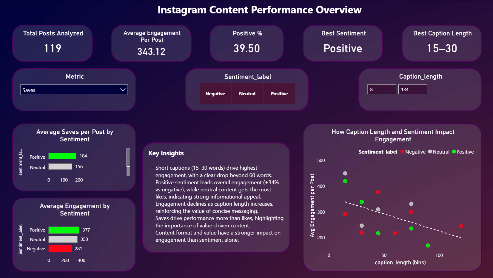
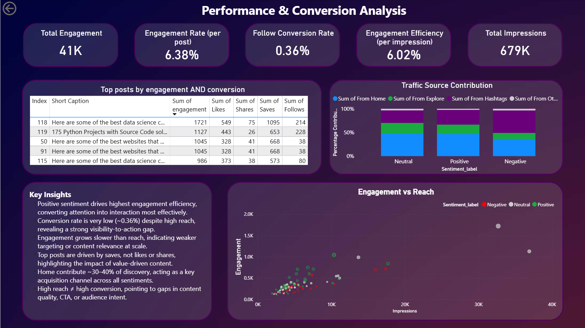
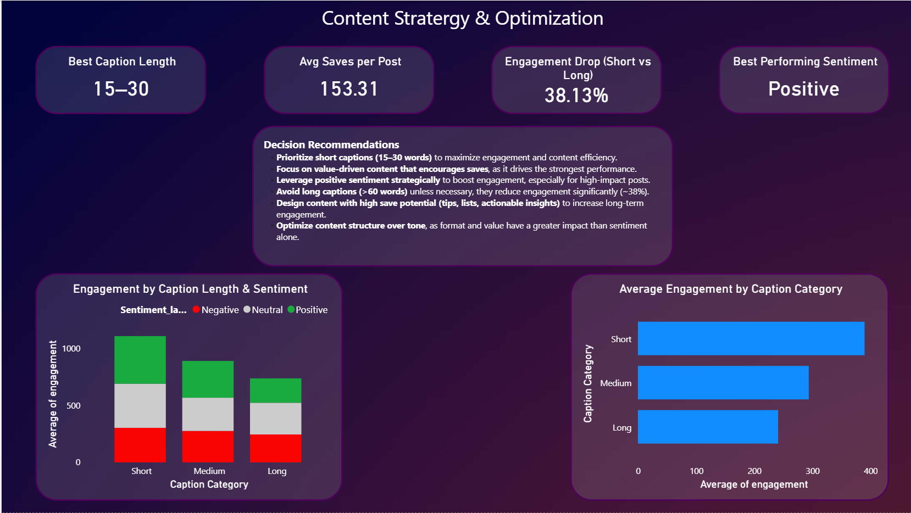

# 📱 Social Media Sentiment & Content Performance Intelligence System

An end-to-end system combining NLP-based sentiment modeling + engagement analytics + executive dashboards to understand what truly drives content performance and user behavior on social media.

⚠️ 41K+ engagement analyzed  
⚠️ 679K+ impressions evaluated  
⚠️ Conversion rate: 0.36% → critical gap identified  
⚠️ Built using ML + behavioral analytics + Power BI  

---

## 🚨 Problem Definition

Most social media analysis focuses on surface-level metrics:

- Likes  
- Impressions  
- Engagement counts  

But fails to answer:

- What type of content actually drives value (saves, follows)?  
- Does sentiment influence engagement, or is structure more important?  
- Why does high reach fail to convert?  
- What should content strategy look like based on data?  

👉 The real challenge:  

**Transform raw engagement data into actionable strategic insights**

---

## 💡 Solution Overview

This project builds a hybrid intelligence system combining:

- NLP-based sentiment classification  
- Feature-driven engagement analysis  
- Behavioral pattern extraction  
- Executive-level dashboards  

👉 Output is not just predictions —  
It is a **decision system for content strategy**

---

## 🧠 System Architecture

Data → NLP Processing → Feature Engineering → Modeling → Behavioral Analysis → Dashboard → Strategy  

---

## ⚙️ Data Sources

- Instagram dataset (`Instagram data.csv`)  
- Twitter sentiment datasets (training + validation)  

👉 Twitter data used to train sentiment model  
👉 Instagram data used for business analysis  

---

## 🔧 NLP Pipeline (Core ML Component)

### Text Processing
- Cleaning (removing noise, symbols, stopwords)  
- Normalization  

### Feature Extraction
- TF-IDF Vectorization (`tfidf.pkl`)  

👉 Converts text into numerical representation for modeling  

### Model Training
- Trained classification model (`model.pkl`)  

👉 Used to classify sentiment into:

- Positive  
- Neutral  
- Negative  

---

### 📌 Why This Approach?

- Lightweight and interpretable  
- Works well on small-to-medium datasets  
- Avoids unnecessary complexity  

---

## ⚠️ Modeling Strategy Decision

Unlike typical projects, this system intentionally limits ML usage.

👉 Why?

- Dataset size is relatively small  
- Overfitting risk is high  
- Goal is insight generation, not prediction accuracy  

---

### ✅ Final Approach

✔ ML used for sentiment extraction  
✔ Analytics used for decision-making  

👉 This separation reflects real-world systems  

---

## 🔧 Feature Engineering (Behavioral Layer)

### Caption Length
- Extracted and categorized into Short / Medium / Long  

👉 Hypothesis: attention span impacts engagement  

---

### Engagement Metrics
- Combined likes, shares, saves  

👉 Unified engagement signal  

---

### Engagement Efficiency
- Engagement / Impressions  

👉 Measures quality of reach  

---

### Conversion Rate
- Follows / Impressions  

👉 Measures business outcome  

---

## 🧠 Analytical Exploration

Instead of blindly modeling, key questions were explored:

- What drives saves vs likes?  
- Does sentiment impact engagement significantly?  
- What caption length performs best?  
- Why is conversion extremely low?  
- Where is engagement being lost?  

---

## 📊 Key Insights

### 🔹 Caption Length Drives Engagement
- Optimal: 15–30 words  
- Engagement drops sharply beyond 60 words  

👉 Short, high-impact content performs best  

---

### 🔹 Sentiment Impact
- Positive → highest engagement efficiency  
- Neutral → strong engagement volume  
- Negative → lowest performance  

👉 Emotion matters, but is not the primary driver  

---

### 🔹 Saves Are the Strongest Signal

👉 High-performing posts are driven by **saves, not likes**

**Interpretation:**

Users value:
- Informational content  
- Reusable insights  
- Practical value  

---

### 🔹 Conversion Gap (Major Finding)
- Conversion rate: 0.36%  

👉 Indicates:
- Weak call-to-action  
- Content not aligned with user intent  
- Engagement without outcome  

---

### 🔹 Reach vs Engagement Problem

👉 Engagement grows slower than impressions  

**Meaning:**  
Scaling reach ≠ scaling value  

---

### 🔹 Traffic Source Behavior

- Home → retention  
- Explore → discovery  
- Hashtags → amplification  

👉 Strategy must vary by channel  

## 📊 Dashboard Insights

Content Performance Overview:


Performance & Conversion Analysis:


Content Strategy & Optimization:


---

## 🧠 Strategy Recommendations

### Content Strategy
- Focus on short captions (15–30 words)
- Create value-driven content (optimize for saves)
- Use sentiment strategically, not blindly

### Conversion Optimization
- Improve call-to-action clarity
- Align content with audience intent
- Design content for outcomes, not just engagement

### Growth Strategy
- Use Explore for reach
- Use Home for retention
- Use hashtags for amplification

---

## 📁 Project Structure

```
SOCIAL MEDIA SENTIMENT ANALYSIS/
│
├── data/
│   ├── Instagram data.csv
│   ├── twitter_training.csv
│   └── twitter_validation.csv
│
├── notebooks/
│   └── sentiment_analysis.ipynb
│
├── models/
│   ├── model.pkl
│   └── tfidf.pkl
│
├── dashboards/
│   └── instagram_dashboard.pbix
│
├── images/
│   ├── dashboard-1.png
│   ├── dashboard-2.png
│   └── dashboard-3.png
│
├── output/
│   └── final_output.csv
│
├── README.md
└── requirements.txt
```

## ⚠️ Limitations

- Limited dataset size  
- No time-series analysis  
- No audience segmentation  
- Basic sentiment model  

---

## 🚀 Future Improvements

- Transformer-based NLP (BERT)  
- Predictive engagement modeling  
- A/B testing content formats  
- Time-based optimization  
- Audience segmentation  

---

## 💼 Business Impact

This system enables:

- Data-driven content strategy  
- Identification of high-performing patterns  
- Reduction of wasted reach  
- Improved engagement efficiency  
- Better conversion alignment  

---

## 🚀 Final Takeaway

Engagement is not random.

It is driven by:

- Structure  
- Value  
- Intent  

👉 This project transforms content strategy from:

❌ Guesswork  
➡️  
✅ Data-driven decision system  

---

## 👤 Author

Paras Dhawan

---